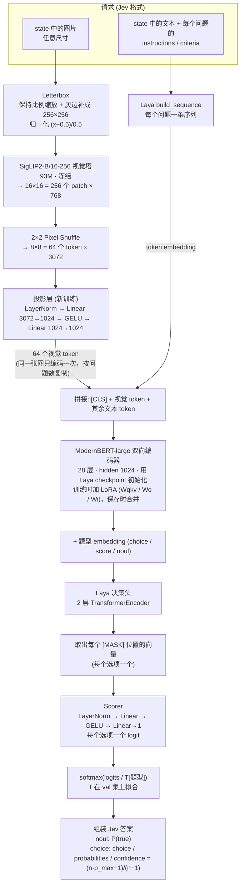

# deVision

**deVision = Decision + Vision**：看图做决策。名字取 **De**cision 的开头和 **Vision** 的全部，两个词共享同一个 `-sion` 结尾，拼起来正好是 “deVision”。
- **Vision**：看图，由 SigLIP2 视觉编码器负责。
- **Decision**：做决策，由 Laya 的 ModernBERT 和决策头负责。它不生成文字，而是直接给出每个选项的校准概率。

它相当于一个能看图的 Jev：输入一张图片和若干英文问题，输出 Jev 格式的结构化答案（`noul` / `choice`）及校准概率。接口兼容 Jev `/v1/systemone`，`state` 里可以放 `{"type": "image", ...}`。

设计与范围见 [`docs/spec/vision-decision-mvp.md`](docs/spec/vision-decision-mvp.md)，常用命令见 [`CLAUDE.md`](CLAUDE.md)。

## 使用

给一张图和几道英文题，返回每道题的答案和校准过的概率。Python 调用可直接用 `image=` 传图；HTTP 请求和响应兼容 Jev `/v1/systemone`，通过 `state` 中的图片片段传图。

### 安装

```bash
pip install "devision @ git+https://github.com/byebyebruce/devision"            # 推理 + HTTP 服务
pip install "devision[train] @ git+https://github.com/byebyebruce/devision"     # 再加训练
```

| 安装项 | 包含 |
|---|---|
| `devision` | 推理（`devision.load`、`Decider.predict` / `decide`）和 HTTP 服务、web demo（`devision-serve`） |
| `devision[train]` | 加上训练、评测、校准和实验流水线（`devision-align`、`devision-train`、`devision-eval`、`devision-calibrate`、`devision-compare`、`devision-pipeline`；依赖 peft、SwanLab 等） |

在本仓库里开发用 `uv sync`，开发依赖组已经包含上面所有内容。

### 在 Python 里调用

```python
import devision

decider = devision.load("lukbit/devision", revision="v0.2")   # Hugging Face 上的发布版；也可传本地 checkpoint 目录
# device 默认 auto（CUDA > MPS > CPU），可指定 device="cpu"；私有仓库先 hf auth login，或传 token="hf_..."

result = decider.predict(            # 和 decider.decide(...) 完全相同，predict 是 Laya 的叫法
    image="photo.jpg",               # 换成你的图片路径，也可传 http(s) URL
    state="",                        # 必填；没有补充文字时传空字符串
    questions={
        "has_fork": {"type": "noul", "instructions": "Is there a fork in the image?"},
        "room": {"type": "choice", "instructions": "Which room is this?",
                 "criteria": {"kitchen": None, "bathroom": "has a sink and a toilet", "bedroom": None}},
    },
)
```

`image` 接受以下输入，库会自动识别；`predict` 和 `decide` 均支持：

| 输入 | 示例 |
|---|---|
| HTTP(S) URL | `image="https://example.com/photo.jpg"`（换成真实图片地址） |
| 本地文件路径 | `image="photo.jpg"` 或 `image=Path("photo.jpg")`（需 `from pathlib import Path`） |
| Data URI | `image="data:image/png;base64,..."`（省略处为完整编码） |
| 纯 Base64 | `image=base64_string`（不带 Data URI 前缀） |
| 图片文件的字节 | `image=image_bytes`（如 PNG/JPEG 文件内容） |
| PIL 图片 | `image=pil_image` |

`state` 是必填的背景信息，可以是字符串、对象或数组；没有背景信息时用 `state=""`。例如需要附带备注时：

```python
damage_result = decider.decide(
    state={"note": "The customer says this item arrived damaged."},
    image="photo.jpg",                   # 或 "https://...", bytes, PIL.Image ...
    questions={"damaged": {"type": "noul", "instructions": "Is the item visibly damaged?"}},
)
```

`note` 是普通背景字段，没有专门的备注参数。Python 仍兼容 `state=[{"type": "image", "url": "https://..."}, "背景文字"]` 的旧写法，但不能同时通过 `image=` 和 `state` 图片片段传图。`state={"image": "photo.jpg"}` 中的字段按文字处理，不会加载图片。

HTTP 仍使用下方的 `state` 图片片段，不支持顶层 `image` 参数或本地路径。HTTP 图片片段的 `url` 只接受 HTTP(S)，`base64` 只接受纯 Base64；Data URI 属于 Python `image=` 支持的格式。

请求格式或图片编码不合法时抛出 `devision.InvalidRequest`（HTTP 服务里对应 422）。Python 读取本地文件失败时也可能抛出 `OSError`。

### 启动 HTTP 服务

```bash
devision-serve --checkpoint lukbit/devision --revision v0.2 --port 8000
```

| 参数 | 作用 |
|---|---|
| `--checkpoint` | 本地目录或 Hugging Face 仓库 id |
| `--revision` | 仓库 id 时固定的 commit、tag 或分支 |
| `--host` / `--port` | 默认 `127.0.0.1:8000` |
| `--device` | `auto`（默认：有 CUDA / Apple GPU 就用，没有就用 CPU）、`cuda`、`mps` 或 `cpu` |
| `--threads` | CPU 推理线程数 |
| `--no-demo` | 只开接口，不挂 web demo |

接口：

- `POST /v1/systemone`：做决策，见下文。
- `GET /health`：返回 `{"status": "ok", "model": "devision-v0.2"}`。
- `GET /`：web demo，包含照片与合成示例场景、图片上传、多题编辑和概率卡片（`--no-demo` 关闭）。支持水平镜像／无图对照、查看请求响应与导出结果；对照会顺序发送两次请求，不是自动评测。

Demo 的中文界面提供物体、动作、计数、颜色、大小、空间关系及磁铁示意图等探索入口；问题和选项仍使用英文。运行后才展示模型实际返回的结果，修改输入会标记已有结果过期。左右关系和科学示意图用于观察能力边界，不保证示例答对。

在本仓库里体验（发布版 v0.2，或本地的同一个 checkpoint `runs/v12-ext/stage2`）：

```bash
uv run devision-serve --checkpoint lukbit/devision --revision v0.2 --port 8000
# 浏览器打开 http://127.0.0.1:8000
```

`--examples <目录>` 可以替换照片示例（默认 `examples/`）；目录不存在或为空时仍可使用内置合成示例和上传功能。纯前端资源随 Python 包分发，不需要 Node 构建或访问外部 CDN。

自动用最快的设备，没有 GPU 的机器用 CPU 也能跑（Mac CPU 4 线程单题约 0.15 秒；同图多题时每题约 0.09 秒）；同一请求里的多道题共用一次图片编码。

### 请求

```bash
curl -s http://127.0.0.1:8000/v1/systemone -H 'Content-Type: application/json' -d '{
  "state": [
    {"type": "image", "url": "https://example.com/kitchen.jpg"},
    "customer says the order arrived damaged"
  ],
  "questions": {
    "has_fork": {"type": "noul", "instructions": "Is there a fork in the image?"},
    "room": {
      "type": "choice",
      "instructions": "Which room is this?",
      "criteria": {"kitchen": null, "bathroom": "has a sink and a toilet", "bedroom": null}
    }
  }
}'
```

- **`state`**：字符串、对象或数组。数组里最多一张图：`{"type": "image", "url": "https://..."}` 或 `{"type": "image", "base64": "..."}`；其余元素是文字背景信息。不带图时等同于纯文本的 Laya。
- **`questions`**：对象，键是你自己起的题目 id，可以一次问多道。
  - `noul`：是非题，`instructions` 写要判断的陈述或问题；`criteria` 可选，用 `{"false": "...", "true": "..."}` 改写两个选项的含义。
  - `choice`：单选题，`criteria` 的键是选项（2–255 个），值是 `null` 或一句说明，帮模型区分相近的选项。
  - `score` 不支持，返回 422。

### 响应

```json
{
  "model": "devision-v0.2",
  "answers": {
    "has_fork": {"type": "noul", "noul": 0.03},
    "room": {
      "type": "choice",
      "choice": "kitchen",
      "probabilities": {"kitchen": 0.81, "bathroom": 0.07, "bedroom": 0.12},
      "confidence": 0.72
    }
  },
  "usage": {"input_tokens": 180, "output_tokens": 0}
}
```

- `noul`：陈述成立的概率。
- `probabilities`：每个选项的概率，和为 1；`choice` 是概率最高的选项。
- `confidence`：按 Jev 的公式 `(n·p_max − 1)/(n − 1)`，0 表示和均匀猜一样，1 表示完全确定。
- 错误：请求格式不对、图片取不到或解码失败、选项放不进模型输入时，返回 422 和 `{"error": "..."}`。

### 怎么用得好

**用概率做阈值，没把握的转给人或更强的模型。** 概率经过按题型的温度校准，但校准程度因题而异：v0.2 在留出的测试集上 ECE 约 0.02–0.06（POPE 0.058、新图计数 0.065，见下方 Benchmark）。阈值请在自己的数据上确定并验证，不要假设 "说 80% 就八成对" 对所有问题都成立。

```python
p = result["answers"]["has_fork"]["noul"]
if p > 0.9:
    handle_yes()
elif p < 0.1:
    handle_no()
else:
    escalate()   # 人工，或者更强的模型（系统 2）
```

阈值请在自己的数据上定：看不同阈值下自动处理的比例和错误率。

**适合问的：**

- 图里有没有某样东西：有没有人、有没有破损、有没有某种物品。
- 是什么、属于哪类：房间类型、动物种类，选项不宜太多。
- 整体判断：室内还是室外、东西看起来是不是坏了。

**不要问的：**

- 在示意图、图表、地图上比较两处（哪根柱子高、哪块磁铁的哪一极、哪条线长）。这类题仍接近随机。
- 相对位置的是非题（"Is the cup to the left of the laptop?"）：同一道题在原图和镜像图上同时答对只有约 19%。改成选择题（"左边还是右边"）好得多。
- 读图中的小字（输入只有 256×256）。
- 非英文问题、一次多张图、`score` 打分题。

**题目写清楚，选项互不重叠。** 选项意思接近时在 `criteria` 里加一句说明。

## Benchmark

数字来自发布版 v0.2（训练轮次 `v12-ext`，训练过程见 [`docs/training-log.md`](docs/training-log.md)），全部经 `decide` 评测（MPS；CPU 上结果相同），已套用拟合温度。每一轮的结果和与上一轮的逐题配对比较都记在训练日志里。

### 与 laya-vision 对比（同一批题逐题配对）

laya-vision 是目前唯一公开的、能看图的 System One 模型。我们按它公开的逐题预测重建了它的评测集（`scripts/data/lv_bench.py`，不运行它的模型），在同一批题上逐题比较；差值 = deVision − laya-vision 201M，95% 区间按图片配对重采样（`devision-compare`）。

| 评测集 | 题数 | laya-vision 201M | deVision v0.2 | 差值 [95% 区间] |
|---|---|---|---|---|
| POPE random / popular / adversarial | 3 × 3,000 | 0.836 / 0.819 / 0.777（公开分，无逐题） | **0.891 / 0.868 / 0.791** | +5.5 / +4.9 / +1.4 个点 |
| VQAv2 是非题 | 4,887 | 0.717 | **0.725** | +0.8 [−0.9, +2.3] |
| A-OKVQA（常识推理，四选一） | 1,138 | 0.598 | **0.626** | +2.7 [−0.6, +6.0] |
| ScienceQA（带图题） | 2,097 | **0.824** | 0.766 | −5.8 [−7.9, −3.6] |

- "有没有某物"（POPE）领先，日常是非题和常识推理略高（区间含 0）；教科书插图仍低 5.8 个点。差距集中在必须看示意图的自然科学题（323 题，0.455 对 0.700），其中磁铁题最多。
- 校准：VQAv2、A-OKVQA 上 NLL 和 ECE 都低于 laya-vision；ScienceQA 的 ECE 0.022（对方 0.028）。
- 其他差别：参数 518M 对 201M；输入 256 px 对 512 px；我们在 Mac CPU 上单题约 150 ms，对方在 L4 GPU 上 41 ms（硬件不同，不可直接比）。逐项分析见 [`docs/research/laya-vision-gap.md`](docs/research/laya-vision-gap.md)。

### 本项目的测试集

`data/v2/test_*`：我们自己出的题，按组平衡（只看题目答不出来），图片与所有训练、dev 数据不重叠（数据集 LookFirst，私有）。VSR、Visual7W 两行按图另行留出（`data/v5/test_*`）；新图计数是第 11 轮新建、从没参与训练的图（`data/v11/test_count_fresh.jsonl`）。*配错图*：同一批题换成别的图片后的准确率。

| 测试集 | 题数 | 准确率 | 配错图 | ECE |
|---|---|---|---|---|
| 存在（有没有某物） | 1,120 | 0.938 | 0.493 | 0.020 |
| VQAv2 多选（13 类） | 1,420 | 0.898 | 0.399 | 0.026 |
| 尺寸（哪个更大） | 1,100 | 0.860 | 0.504 | 0.036 |
| POPE（3 档合计，`bench_pope`） | 8,676 | 0.851 | 0.527 | 0.058 |
| GQA val | 992 | 0.784 | 0.532 | 0.042 |
| 位置（上下 0.909，左右 0.836） | 1,274 | 0.872 | 0.493 | 0.025 |
| VQAv2 是非 | 1,000 | 0.710 | 0.518 | 0.022 |
| 相对位置（上下 0.838，左右 0.672） | 1,950 | 0.711 | 0.484 | 0.047 |
| VSR 物体关系（按图留出，`test_vsr`） | 904 | 0.679 | 0.481 | 0.048 |
| Visual7W 四选一（按图留出，`test_v7w`） | 1,000 | 0.721 | 0.422 | 0.030 |
| 新图计数（`test_count_fresh`） | 600 | 0.740 | 0.507 | 0.065 |

配错图后都回到随机或只看题目的水平，说明分数来自看图。左右关系：同一道左右题在原图和左右镜像图上同时答对的比例，位置题 72%、相对位置选择题 65%（v11 为 61% / 39%）；相对位置是非题 19%，仍低于随机的 25%。

## 已知限制

- **按文字找到图里两处再比较还不会**：示意图、图表、地图上的比较题（ScienceQA 磁铁题、FigureQA、MapQA）接近随机；相对位置是非题原图与镜像同时答对只有 19%。诊断见实验记录和训练日志 v12 一节。
- **"有没有某物"偏向答"有"**：v0.2 比上一版更常把标注为不存在的物体答成存在（存在题 0.955 → 0.938，POPE adversarial 0.791）。
- 只支持英文、单张图、`noul` / `choice`（`score` 返回 422）。
- 输入 letterbox 到 256×256，图中小字和细节会丢失。

## 代码结构

```
src/devision/
├── __init__.py   对外入口 devision.load(...)（import devision 不加载 torch）
├── model.py      网络结构：SigLIP2 → 投影层 → ModernBERT + Laya 决策头
├── image.py      图片读取与 letterbox 预处理
├── infer.py      Decider：checkpoint 读写、decide / predict（推理入口）
├── serve.py      POST /v1/systemone API 和 web demo 路由；命令 devision-serve
├── static/       web demo 页面
└── train/        训练、评测、校准、实验流水线（需 devision[train]）；命令 devision-align / train / eval / calibrate / compare / pipeline
examples/         demo 默认加载的示例图；examples/train/ 是训练数据格式示例
scripts/data/     生成训练和评测数据的脚本（不随包分发）
configs/          每一轮训练的 YAML
```

依赖只能单向：`train` 和 `serve` 建立在推理代码（`model` / `image` / `infer`）之上，推理代码不引用它们；demo 页面只通过 HTTP 调用 API。

## 模型结构



### 编码器看到的序列

每个问题单独构成一条序列（下例是 `choice`，3 个选项）：

```
[CLS] V1 V2 … V64  choice question: Is the person standing or sitting? [SEP]
      └─ 视觉 ─┘   └──────────── 题型 + instructions ───────────┘
[MASK] standing  [MASK] sitting: on a chair or the ground  [MASK] lying  [SEP]  <state 文本>  [SEP]
  ↑ 选项 0         ↑ 选项 1                                  ↑ 选项 2
```

- `noul` 固定两个选项，顺序为 `[false, true]`，默认文本是 `false: no, the statement does not hold` 和 `true: yes, the statement holds`；`criteria` 可覆盖这两段描述。
- 文本部分由 Laya 的 `build_sequence` 生成，上限 512 token（选项区 192）。视觉 token 由模型插在 `[CLS]` 之后，并自动平移 `[MASK]` 位置。
- 纯文本请求（不带图）不插视觉 token，行为与 Laya 相同。
- 选项放不进输入时返回 422，不会悄悄丢掉选项。

### 参数与训练

| 模块 | 规模 | 来源 | 训练时 |
|---|---|---|---|
| SigLIP2-B/16-256 视觉塔 | 93M（含未用到的 pooling head） | `google/siglip2-base-patch16-256` | 冻结 |
| 投影层 | 4M | 随机初始化 | 全量训练 |
| ModernBERT-large 编码器 | 395M | `convaiinnovations/laya` | LoRA（保存时合并） |
| 决策头（题型 embedding + 2 层 Transformer + scorer） | 27M | `convaiinnovations/laya` | 全量训练 |
| **合计** | **518M** | | |

- 训练目标：RLCD，沿用 Laya 官方单卡脚本。它由两部分组成：对加了噪声的 logit 做策略梯度，奖励用 log、spherical 和 RPS 三种 proper scoring rule；再加上对 gold 分布的 soft 交叉熵。
- 训练结束后，按题型在 val 集上用 LBFGS 拟合温度 T，范围限制在 [0.5, 5]。
- 训练分两个阶段：
  - **阶段 1 对齐**（`devision-align`）：带图完形填空，只训投影层。数据是 COCO train2014 全部 caption。
  - **阶段 2 决策**（`devision-train`）：RLCD，训投影层、决策头和 ModernBERT 的 LoRA。之后每一轮从上一轮的最佳 checkpoint 接着训，逐步加入 COCO 自动出题（存在、位置、大小）、VQAv2、GQA、A-OKVQA、ScienceQA、VSR、Visual7W、左右镜像对和计数。
  - v0.2 是第 12 轮（[`configs/v12-ext.yaml`](configs/v12-ext.yaml)）：从第 11 轮接着训一遍 353,830 道题，其中扩展数据包 315,342 道来自 13 个公开数据集（Objects365、TallyQA、CLEVR、FigureQA、SNLI-VE、IconQA、Vision-Flan 等），在 Mac（MPS）上约 16 小时。每一轮改了什么、结果如何见 [`docs/training-log.md`](docs/training-log.md)。新实验复制一份 YAML，改参数和 `name`（第 13 轮起命名为 `r<轮次>-<描述>`，即 `runs/r13-xx/`）。
- 训练数据是 JSONL 样本，格式见 `src/devision/train/samples.py`；[`examples/train/`](examples/train/) 里有每种写法的示例数据，`uv run devision-pipeline configs/example.yaml` 能在 CPU 上一两分钟内跑通整个流程。生成数据的代码（下载与规则转换）在 [`scripts/data/`](scripts/data/)，见下面「在新机器上训练」。所有评测图片按 COCO 和 VG 两套 id 从训练数据中剔除。
- 实验过程和结论见 [`docs/experiments/2026-09-30-rlcd-plateau.md`](docs/experiments/2026-09-30-rlcd-plateau.md)。

### 在新机器上训练

```bash
uv sync                                   # 依赖（含训练和服务的 extras）
bash scripts/data/build_all.sh data       # 从原始来源生成数据：下载几十 GB、几个小时；日志同时写到 data/build_all.log
bash scripts/download_models.sh           # 可选：先下载 Laya、SigLIP2、ModernBERT 的权重
uv run swanlab login                      # 训练默认上报 SwanLab；不想上报就在配置里关掉
uv run devision-pipeline configs/scratch.yaml        # 从头训练：align -> stage2a -> stage2b，device: auto（CUDA > MPS > CPU）
# 单卡 A100：uv run devision-pipeline configs/scratch-a100.yaml
```

- `build_all.sh` 生成 `scratch.yaml` 和第 3–9 轮配置用到的数据，最后核对这些配置引用的数据文件和图片都存在且非空，缺了会列出来并返回非零。中断后重跑会跳过已下载的部分。不生成第 1–2 轮的旧数据和第 10–11 轮的专项数据。
- 第 12 轮的扩展数据包用 `bash scripts/data/ext/build_ext.sh data` 生成（每个来源一个脚本，可断点续传；需要先有 `build_all.sh` 的输出和 `scripts/data/v11_count_eval.py` 生成的 `data/v11/`，以便剔除评测图片）。
- 生成的数据和本机的规则、比例相同，不保证逐条一致，也不会自动复现发布版的权重或分数。
- `scratch.yaml` 只训练到大致相当于第 5 轮的模型（输出 `runs/scratch/stage2b`）。后面各轮的配置（`v6-flip-lr.yaml` 起）是历史实验记录，`init` 指向本机的 `runs/` 路径，有的写死 `device: mps`。要在新机器上接着训，复制一份，把 `init` 改成新机器上实际的 checkpoint、把 `device` 改成 `auto` 或 `cuda`。
- 数据目录不是 `data/` 时，训练配置里的数据路径要一起改，构建脚本不会自动改配置。
