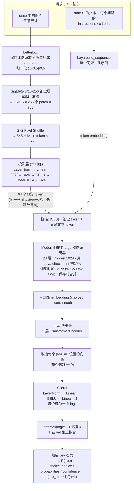

# deVision

**deVision = Decision + Vision**：看图做决策。名字取 **De**cision 的开头和 **Vision** 的全部，两个词共享同一个 `-sion` 结尾，拼起来正好是 “deVision”。
- **Vision**：看图，由 SigLIP2 视觉编码器负责。
- **Decision**：做决策，由 Laya 的 ModernBERT 和决策头负责。它不生成文字，而是直接给出每个选项的校准概率。

它相当于一个能看图的 Jev：输入一张图片和若干英文问题，输出 Jev 格式的结构化答案（`noul` / `choice`）及校准概率。接口兼容 Jev `/v1/systemone`，`state` 里可以放 `{"type": "image", ...}`。

设计与范围见 [`docs/spec/vision-decision-mvp.md`](docs/spec/vision-decision-mvp.md)，常用命令见 [`CLAUDE.md`](CLAUDE.md)。

## 代码结构

```
src/devision/
├── model/     模型：网络结构、图片预处理、checkpoint 读写、Decider.decide（推理入口）
├── train/     训练：样本格式、对齐（阶段 1）、RLCD 训练（阶段 2，SwanLab 可视化）、评测；命令 devision-align / train / eval
├── serve/     服务：POST /v1/systemone API（CPU）；命令 devision-serve
└── demo/      Web demo：页面与示例图路由，由 devision-serve 挂载（--no-demo 可关）
examples/      demo 默认加载的示例图
```

依赖只能单向：`train`、`serve`、`demo` 都建立在 `model` 之上，三者之间互不引用。`model` 不依赖其他子包；`demo` 只通过 HTTP 调用 API，不引用任何 Python 代码。

## 模型结构



### 编码器看到的序列

每个问题单独构成一条序列（下例是 `choice`，3 个选项）：

```
[CLS] V1 V2 … V64  choice question: Is the person standing or sitting? [SEP]
      └─ 视觉 ─┘   └──────────── 题型 + instructions ───────────┘
[MASK] standing  [MASK] sitting: on a chair or the ground  [MASK] lying  [SEP]  <state 文本>  [SEP]
  ↑ 选项 0         ↑ 选项 1                                  ↑ 选项 2
```

- `noul` 固定两个选项，顺序为 `[false, true]`，默认文本是 `false: no, the statement does not hold` 和 `true: yes, the statement holds`；`criteria` 可覆盖这两段描述。
- 文本部分由 Laya 的 `build_sequence` 生成，上限 512 token（选项区 192）。视觉 token 由模型插在 `[CLS]` 之后，并自动平移 `[MASK]` 位置。
- 纯文本请求（不带图）不插视觉 token，行为与 Laya 相同。
- 选项放不进输入时返回 422，不会悄悄丢掉选项。

### 参数与训练

| 模块 | 规模 | 来源 | 训练时 |
|---|---|---|---|
| SigLIP2-B/16-256 视觉塔 | 93M（含未用到的 pooling head） | `google/siglip2-base-patch16-256` | 冻结 |
| 投影层 | 4M | 随机初始化 | 全量训练 |
| ModernBERT-large 编码器 | 395M | `convaiinnovations/laya` | LoRA（保存时合并） |
| 决策头（题型 embedding + 2 层 Transformer + scorer） | 27M | `convaiinnovations/laya` | 全量训练 |
| **合计** | **518M** | | |

- 训练目标：RLCD，沿用 Laya 官方单卡脚本。它由两部分组成：对加了噪声的 logit 做策略梯度，奖励用 log、spherical 和 RPS 三种 proper scoring rule；再加上对 gold 分布的 soft 交叉熵。
- 训练结束后，按题型在 val 集上用 LBFGS 拟合温度 T，范围限制在 [0.5, 5]。
- 训练分两个阶段：
  - **阶段 1 对齐**（`devision-align`）：带图完形填空，只训投影层。数据是 COCO train2014 全部 caption。
  - **阶段 2 决策**（`devision-train`）：RLCD，训投影层、决策头和 ModernBERT 的 LoRA。先在 6 万 GQA + 4 万 VQAv2 是非题上训，再在从 COCO 实例框自动出的题（有没有某物、位置、大小）上接着训。
  - 发布的 checkpoint 的完整步骤见 [`scripts/recipe.sh`](scripts/recipe.sh)，在 Mac（MPS）上共约 16 小时。
- 训练数据是 JSONL 样本，格式见 `src/devision/train/samples.py`。生成数据的代码（GQA / VQAv2 / POPE / COCO 的下载与规则转换）不在仓库里。所有评测图片按 COCO 和 VG 两套 id 从训练数据中剔除。
- 实验过程和结论见 [`docs/experiments/2026-09-30-rlcd-plateau.md`](docs/experiments/2026-09-30-rlcd-plateau.md)。

## 使用

```bash
pip install "devision[serve] @ git+https://github.com/byebyebruce/devision"
devision-serve --checkpoint HF_REPO_ID --port 8000   # 也可以是本地 checkpoint 目录；浏览器打开 / 是 web demo
```

```python
import devision

decider = devision.load("HF_REPO_ID")          # 或本地目录
decider.predict(                               # 同 decide()
    state=[{"type": "image", "url": "https://example.com/kitchen.jpg"}],
    questions={
        "fork": {"type": "noul", "instructions": "Is there a fork in the image?"},
        "room": {"type": "choice", "instructions": "Which room is this?",
                 "criteria": {"kitchen": None, "bathroom": None, "bedroom": None}},
    },
)
```

请求和响应格式、HTTP 参数、怎么设阈值、适合问什么，见 [`docs/usage.md`](docs/usage.md)。

## 结果

发布的 checkpoint（`stage2-cocoqa`），全部经 `decide` 在 CPU 上评测，已套用拟合温度：

| 评测集 | 题数 | 准确率 | ECE |
|---|---|---|---|
| POPE adversarial（"有没有 X"） | 300 | 0.773 | 0.098 |
| VQAv2 val yes/no（按图重切，正负各半） | 1,000 | 0.648 | 0.025 |
| GQA testdev（是非 + 二选一） | 1,000 | 0.635（是非 0.639，选择 0.628） | 0.042 |
| COCO 实例框出题（val2014） | 1,000 | 0.761 | 0.054 |

- 对照：laya-vision 201M（SmolVLM-256M 骨干，512 px，182 万训练样本）POPE adversarial 0.777、VQAv2 yes/no 0.715。
- Mac CPU 上单题延迟 P50 约 160–190 ms。

## 已知限制

- **分不清 "文字说的那个东西在哪"**：左右类问题（"Is the cup to the left of the laptop?"）在随机水平。上下、大小题的成绩大部分来自类别先验。诊断见实验记录。
- 只支持英文、单张图、`noul` / `choice`（`score` 返回 422）。
- 输入 letterbox 到 256×256，图中小字和细节会丢失。
